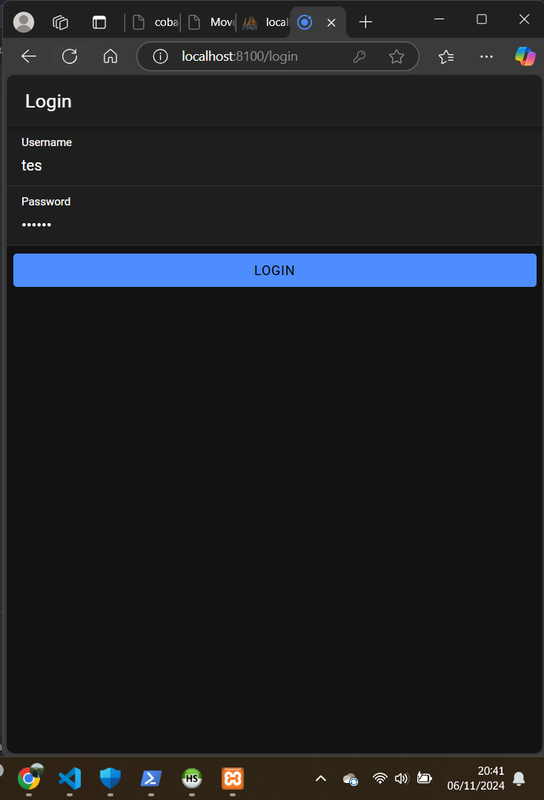
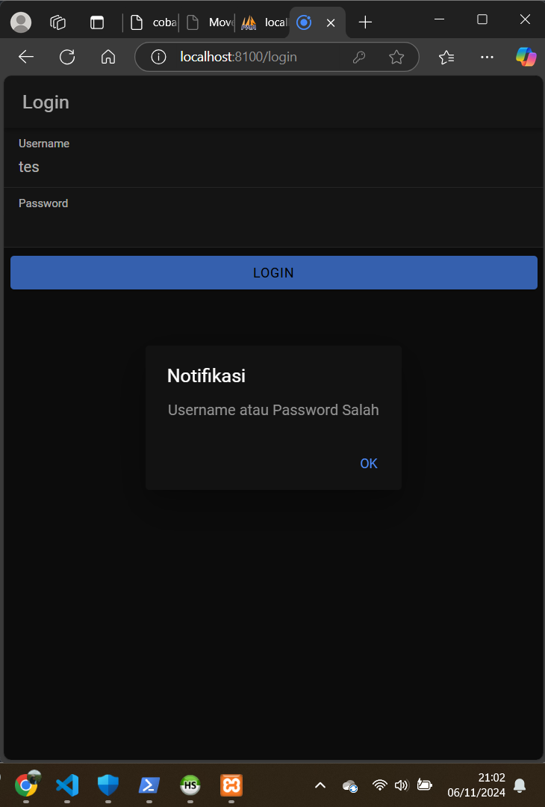
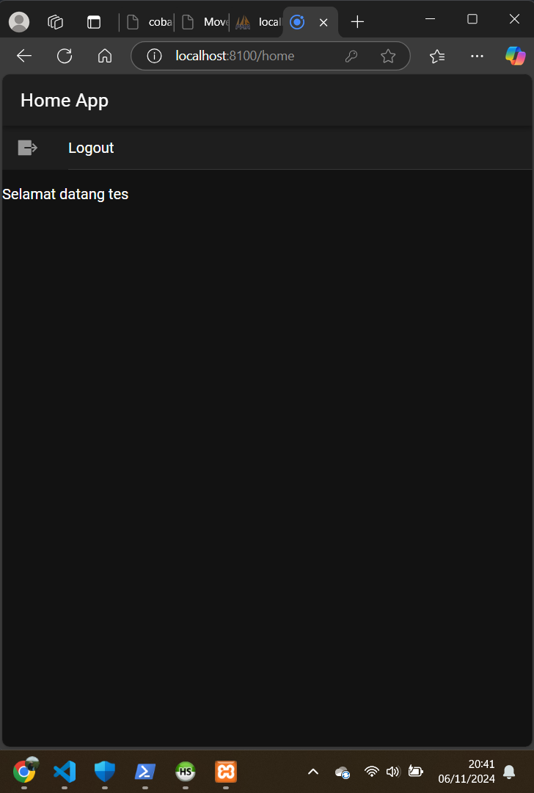

Tugas Praktium Coba Login

Nama    : Dhiya Ulhaq Ayyuasy
NIM     : H1D021040
Shift   : B->D

Proses Login yang berjalan dibuat menggunakan PHP dan MySQL sebagai backend serta Ionic sebagai frontend. Proses yang berjalan adalah sebagai berikut:

1. Pengguna Mengisi Informasi Login: Pengguna memasukkan username dan password di aplikasi Ionic dan menekan tombol "Login".

2. Aplikasi Mengirim Permintaan Login: Aplikasi mengirim permintaan POST ke login.php di server dengan data username dan password dalam format JSON.

3. Server Memvalidasi Kredensial: 
login.php menerima data login dan menghubungkan ke database.
Server memeriksa apakah username dan password yang diberikan cocok dengan data di tabel user.
Password dibandingkan setelah di-hash dengan MD5.

4. Login Berhasil atau Gagal:
Berhasil: Server merespons dengan status_login: "berhasil", bersama dengan token yang dihasilkan untuk sesi tersebut.
Gagal: Server merespons dengan status_login: "gagal" jika kredensial tidak cocok.

 
5. Aplikasi Menangani Respons:
Jika Berhasil: Aplikasi menyimpan token dan mengarahkan pengguna ke halaman utama.
Jika Gagal: Aplikasi menampilkan pesan error dan meminta pengguna memeriksa kredensial mereka.
jika pass dan usernaame tidak sesuai maka akan menampilkan notifikasi 'Username atau Password Salah' 

6. Jika berhasil login maka akan menampilkan halaman homepage

7. Pada homepage terdapat logout yang dapat memungkinkan user kembali ke halaman login